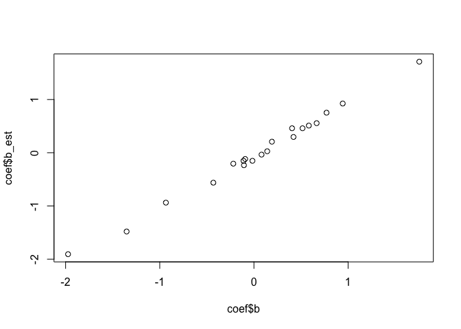
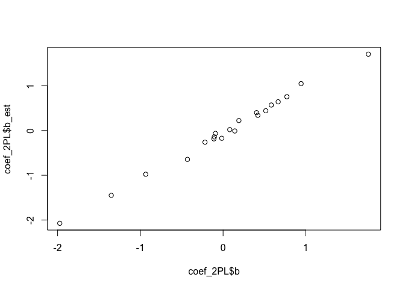
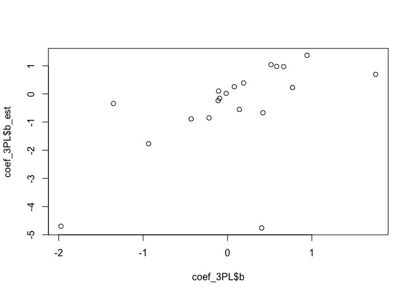
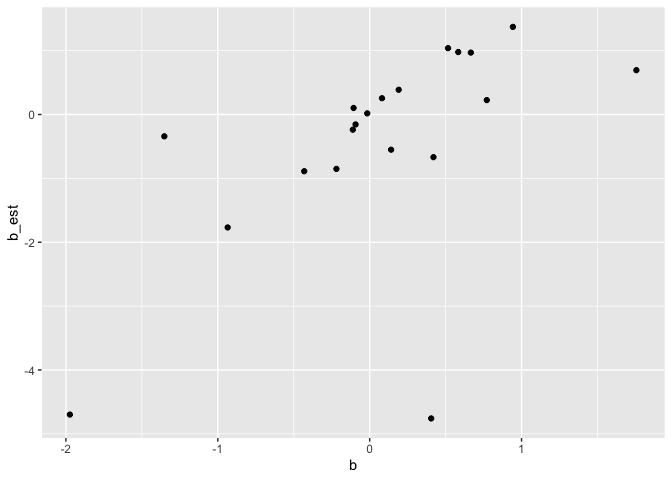
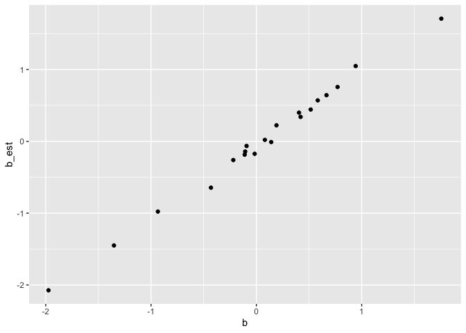
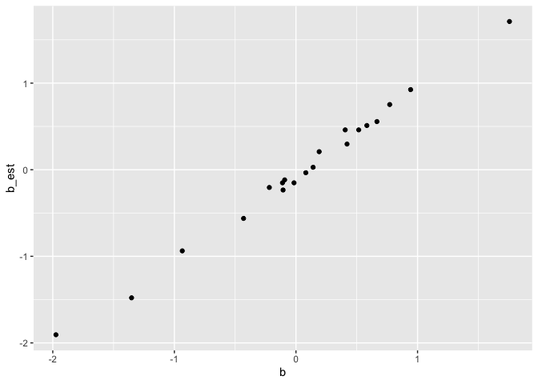

IRT trial code
================
radhika
11/29/2020

``` r
#install.packages("dplyr")
library(tidyr)
library(dplyr)
```

    ## 
    ## Attaching package: 'dplyr'

    ## The following objects are masked from 'package:stats':
    ## 
    ##     filter, lag

    ## The following objects are masked from 'package:base':
    ## 
    ##     intersect, setdiff, setequal, union

``` r
library(stringr) 
library(ggplot2)
library(readr)
library(norm)
library(knitr)


#install.packages("psych")
library(psych)
```

    ## 
    ## Attaching package: 'psych'

    ## The following objects are masked from 'package:ggplot2':
    ## 
    ##     %+%, alpha

``` r
library(mirt)
```

    ## Loading required package: stats4

    ## Loading required package: lattice

``` r
#install.packages("lmtest")
library(lmtest)
```

    ## Loading required package: zoo

    ## 
    ## Attaching package: 'zoo'

    ## The following objects are masked from 'package:base':
    ## 
    ##     as.Date, as.Date.numeric

## Objectives

*1. Simulate a response dataset, using 1PL, 2 PL and 3PL*

*2. Estimate each model and check for fit :* a. Estimate item parameters
using mirt for 1PL, 2PL and 3PL models b. Compare model fit using LR
(nested models), AIC and BIC (not nested) - (using statistics from MIRT)
c. Estimate RSME for data generation and estimation for 1PL, 2PL and 3PL
- *I can’t replicate results from paper here* d. Run 50 simulations to
see which model gives the best item parametrics

#### Not doing this part

3.  Estimate item parameters using Bayesian parameter estimates
4.  Compare model fit using cross-validation log likelihood (CVLL) and
    Deviance Information Criterion (DIC)

#### Have to do this part

\*3. Prediction following Ben’s work

### Simulate dataset

``` r
 #Set the seed and generate the parameters
 
#nitem=20
#sample.size=1000
#model="2PL"

##function to generate dataset
 
fun_simulate_data= function(nitem, sample.size, model,a, b,c, ability) {
 #Simulate response data 
    if (model == "1PL"){
 dat <- simdata(a = a, 
                d = b, 
                N = sample.size, 
                itemtype = '2PL', 
                Theta = ability)
    }
 
 if (model == "2PL"){
 dat <- simdata(a = a, 
                d = b, 
                N = sample.size, 
                itemtype = '2PL', 
                Theta = ability)
 }
 
 if (model == "3PL"){
 dat <- simdata(a = a, 
                d = b, 
                N = sample.size, 
                itemtype = '3PL', 
                guess = c, 
                Theta = ability)
 }

  return(dat)
  
 }
```

# Separate data generation into three functions - one each for 1PL, 2PL and 3 PL

Tried this out but didn’t end up using it, it didnt change the results

``` r
# fun_simulate_1PL= function(nitem, sample.size, a, b, c, ability) {
#   dat <- simdata(a = a, 
#                 d = b, 
#                 N = sample.size, 
#                 itemtype = 'dich', 
#                 guess = c
#                 Theta = ability)
#   return(dat)
#   }
# 
# 
# fun_simulate_2PL= function(nitem, sample.size, a, b, ability) {
#   dat <- simdata(a = a, 
#                 d = b, 
#                 N = sample.size, 
#                 itemtype = '2PL', 
#                 guess = c, 
#                 Theta = ability)
#   return(dat)
# }
# 
# fun_simulate_3PL= function(nitem, sample.size, a, b, c, ability) {
#   dat <- simdata(a = a, 
#                 d = b, 
#                 N = sample.size, 
#                 itemtype = '3PL', 
#                 guess = c, 
#                 Theta = ability)
#   return(dat)
#}
```

### Extract item parameters using different models

``` r
fun_model_fit= function(model1PL, model2PL, model3PL) {
  
#extract fit statistics
aic1PL = extract.mirt(model1PL, 'AIC')
bic1PL = extract.mirt(model1PL, 'BIC')
Gsq_1PL = extract.mirt(model1PL, 'G2')
loglik_1PL=extract.mirt(model1PL, "logLik")


parameters= cbind("model"=c("1PL"), "AIC"=round(aic1PL,3), "BIC"=round(bic1PL,3), "G-sq"=round(Gsq_1PL,3), "LL"=round(loglik_1PL, 3))

aic2PL = extract.mirt(model2PL, 'AIC')
bic2PL = extract.mirt(model2PL, 'BIC')
Gsq_2PL = extract.mirt(model2PL, 'G2')
loglik_2PL=extract.mirt(model2PL, "logLik")

parameters1= cbind("model"=c("2PL"), "AIC"=round(aic2PL,3), "BIC"=round(bic2PL,3), "G-sq"=round(Gsq_2PL,3), "LL"=round(loglik_2PL, 3))

aic3PL = extract.mirt(model3PL, 'AIC')
bic3PL = extract.mirt(model3PL, 'BIC')
Gsq_3PL = extract.mirt(model3PL, 'G2')
loglik_3PL=extract.mirt(model3PL, "logLik")

parameters2= cbind("model"=c("3PL"), "AIC"=round(aic3PL,3), "BIC"=round(bic3PL,3), "G-sq"=round(Gsq_3PL,3), "LL"=round(loglik_3PL, 3))

#combine fit statistics
parameters=rbind(parameters, parameters1, parameters2)

return(parameters)
}


#parameters <- as.data.frame(coef(model1PL, simplify=TRUE)$items)
```

### Calling functions - Study 1

For data generated from 3 PL- AIC and G-squared finds 3PL to be the best
fit, and BIC finds 2PL to be the best fit

``` r
# Generate datasets similar to Kang Cohen
## Study 1 -  Block 4 has 21 multiple choice items, 1000 students. the paper said 3PM was the best fit, so generating data using 3PM

nitem= 21
sample.size=1000
a <- as.matrix(round(rlnorm(nitem, meanlog = 0, sdlog = 1),3), ncol=1) #lognormal
  b <- as.matrix(round(rnorm(nitem, mean = 0, sd = 1),3), ncol=1) #normal
  c <- as.matrix(round(rbeta(nitem, shape1 = 5, shape2 = 17),3), ncol=1) #beta
  ability <- as.matrix(round(rnorm(sample.size, mean = 0, sd = 1),3), ncol=1) #normal

dat = fun_simulate_data(21, 1000, "3PL",a, b,c,ability)


# Estimate model fit 

#estimate IRT parameters
model1PL <- mirt(data=dat, 1, itemtype='Rasch', SE=TRUE, verbose=FALSE)
model2PL <- mirt(data=dat, 1, itemtype='2PL', SE=TRUE, verbose=FALSE)
model3PL <- mirt(data=dat, 1, itemtype='3PL', SE=TRUE, verbose=FALSE)
```

    ## Warning: Could not invert information matrix; model likely is not empirically
    ## identified.

``` r
fit_statistics = fun_model_fit(model1PL, model2PL, model3PL)
fit_statistics
```

    ##      model AIC         BIC         G-sq        LL          
    ## [1,] "1PL" "26125.637" "26233.608" "12345.852" "-13040.819"
    ## [2,] "2PL" "25081.8"   "25287.926" "11262.015" "-12498.9"  
    ## [3,] "3PL" "24966.661" "25275.85"  "11104.876" "-12420.331"

``` r
## 3PL gives the best fit


## Study 2 - 
# 2 test lengths, 20 and 40 items. 
# 2 sample sizes, 500 and 1000 examinees  
```

### Simulate and fit data, and compare RSME and correlation (Table 5)

Steps followed in this section:

1.  Taken the case for number of items as 20 and sample size as 500

2.  Generate parameters (a, d, c).

3.  Using parameters, generate 1PL, 2 PL and 3 PL datasets.

4.  Estimate parameters for each of the datasets, using the correct
    model (i.e. estimate b for 1PL, a\&b for 2PL and a\&b\&c for 3PL).
    Estimated parameters are names a\_est, b\_est, c\_est

5.  Compare estimations using RSME

#### Issue faced -

1.  The paper said that 1PL always performs better according to RSME,
    but for me, 2PL performs better
2.  The paper mentioned mean-mean linking - “Before calculating RMSEs,
    the estimated parameters were linked to the generating parameter
    scale using the mean-mean procedure (pg 7)”. I am not sure what this
    means

##### please note - sd for a is 0.5, in accordance with Kang & Cohen?

``` r
# Simulate data for Study 2

## Test length = 20 items, sample size = 500
## Item difficulty b ~ N(0,1), a∼ln(0,0.5), c~B(5,17)
## 3 distributions of ability: N(-1,1) = low ability, N(0,1) = ability at item difficulty level and N(1,1) = high ability

nitem=20
sample.size=1000

a <- as.matrix(round(rlnorm(20, meanlog = 0, sdlog = 0.5),3), ncol=1) #lognormal
a1<- matrix(rep( 1, len=20), ncol = 1)
b <- as.matrix(round(rnorm(20, mean = 0, sd = 1),3), ncol=1) #normal
c <- as.matrix(round(rbeta(20, shape1 = 5, shape2 = 17),3), ncol=1) #beta
c1<- matrix(rep( 0, len=20), ncol = 1)


low_ability <- as.matrix(round(rnorm(1000, mean = -1, sd = 1),3), ncol=1) #normal
med_ability <- as.matrix(round(rnorm(1000, mean = 0, sd = 1),3), ncol=1) #normal
high_ability <- as.matrix(round(rnorm(1000, mean = 1, sd = 1),3), ncol=1) #normal

# Generate datasets, low ability
#dat_1PL= fun_simulate_1PL(nitem, sample.size,  a, b, low_ability)
#dat_2PL= fun_simulate_2PL(nitem, sample.size,  a, b, low_ability)
#dat_3PL= fun_simulate_3PL(nitem, sample.size,  a, b, c, low_ability)

dat_1PL = fun_simulate_data(20, 1000, "1PL", a1, b,c1, med_ability)
dat_2PL = fun_simulate_data(20, 1000, "2PL", a, b,c1, med_ability)
dat_3PL = fun_simulate_data(20, 1000, "3PL", a, b,c, med_ability)

# estimate IRT parameters
## estimate parameters for 1PL
model1PL <- mirt(data=dat_1PL, 1,itemtype='Rasch', SE=FALSE, verbose=FALSE)
coef = as.data.frame(coef(model1PL, simplify=T)$items[,2]) %>%
  tibble::rownames_to_column(., "Item no") %>%
  mutate("b"= b) %>%
  rename(b_est= "coef(model1PL, simplify = T)$items[, 2]")

plot(coef$b,coef$b_est)
```

<!-- -->

``` r
## estimate parameters for 2PL
model2PL <- mirt(data=dat_2PL, 1, itemtype='2PL', SE=TRUE, verbose=FALSE)
b_est= coef(model2PL, simplify=T)$items[,2]
a_est=coef(model2PL, simplify=T)$items[,1]
coef_2PL = data.frame(b_est, b,  a_est, a) 
coef_2PL = tibble::rownames_to_column(coef_2PL, "Item no")

plot(coef_2PL$b,coef_2PL$b_est)
```

<!-- -->

``` r
## estimate parameters for 3PL
model3PL <- mirt(data=dat_3PL, 1, itemtype='3PL', SE=TRUE, verbose=FALSE)
```

    ## EM cycles terminated after 500 iterations.

``` r
b_est= coef(model3PL, simplify=T)$items[,2]
a_est=coef(model3PL, simplify=T)$items[,1]
c_est=coef(model3PL, simplify=T)$items[,3]
coef_3PL = data.frame(b_est, b,  a_est, a, c_est, c) 

plot(coef_3PL$b,coef_3PL$b_est)
```

<!-- -->

``` r
## Plot original and estimates
coef_3PL %>% 
  ggplot(aes(x=b,y=b_est)) +geom_point()
```

<!-- -->

``` r
coef_2PL %>% 
  ggplot(aes(x=b,y=b_est)) +geom_point()
```

<!-- -->

``` r
coef %>% 
  ggplot(aes(x=b,y=b_est)) +geom_point()
```

<!-- -->

``` r
# Estimate RSME 
rsme = sqrt(mean((coef$b - coef$b_est)^2))
rsme_b_2PL = sqrt(mean((coef_2PL$b - coef_2PL$b_est)^2))
rsme_a_2PL = sqrt(mean((coef_2PL$a - coef_2PL$a_est)^2))
rsme_b_3PL = sqrt(mean((coef_3PL$b - coef_3PL$b_est)^2))
rsme_a_3PL = sqrt(mean((coef_3PL$a - coef_3PL$a_est)^2))


# Estimate correlation 
## Paper says product moment correlation, I think this is Pearson?
### All highly correlated (>.9) and significant
cor.test(coef$b, coef$b_est, method="pearson",alternative="two.sided",na.action)
```

    ## 
    ##  Pearson's product-moment correlation
    ## 
    ## data:  coef$b and coef$b_est
    ## t = 52.886, df = 18, p-value < 2.2e-16
    ## alternative hypothesis: true correlation is not equal to 0
    ## 95 percent confidence interval:
    ##  0.9917347 0.9987612
    ## sample estimates:
    ##       cor 
    ## 0.9967977

``` r
cor.test(coef_2PL$b, coef_2PL$b_est, method="pearson",alternative="two.sided",na.action)
```

    ## 
    ##  Pearson's product-moment correlation
    ## 
    ## data:  coef_2PL$b and coef_2PL$b_est
    ## t = 54.474, df = 18, p-value < 2.2e-16
    ## alternative hypothesis: true correlation is not equal to 0
    ## 95 percent confidence interval:
    ##  0.9922062 0.9988321
    ## sample estimates:
    ##       cor 
    ## 0.9969808

``` r
cor.test(coef_3PL$b, coef_3PL$b_est, method="pearson",alternative="two.sided",na.action)
```

    ## 
    ##  Pearson's product-moment correlation
    ## 
    ## data:  coef_3PL$b and coef_3PL$b_est
    ## t = 2.9659, df = 18, p-value = 0.008276
    ## alternative hypothesis: true correlation is not equal to 0
    ## 95 percent confidence interval:
    ##  0.1747383 0.8100836
    ## sample estimates:
    ##       cor 
    ## 0.5729552

``` r
# Compare model fit - b
rsme
```

    ## [1] 0.08461631

``` r
rsme_b_2PL
```

    ## [1] 0.08790169

``` r
rsme_b_3PL
```

    ## [1] 1.420304

``` r
# Compare model fit - a
rsme_a_2PL
```

    ## [1] 0.1363326

``` r
rsme_a_3PL
```

    ## [1] 0.8787737

``` r
## rsme is lowest for 2PL
```

### Compare models (Table 9)

This replication is only conducted for the case of low ability, 20
items, 500 sample size i.e. the first 3 rows of Table 9. The tests
explored are AIC, BIC, Log likelihood and G-squared.

#### Points of doubt:

1.  I generate parameters (a,b,c) only once. Using this, data is
    generated. Using generated datasets, parameters are estimated for 50
    iterations, and we see which model performed best. Is this
    understanding right

2.  I find that the model that generated the dataset is not the best
    performing model, in contrast to Kang & Cohen’s findings:

<!-- end list -->

  - Case examined: 20 items, 500 sample size, low ability

  - When data is generated by 1PL: AIC, BIC and G-square are not the
    lowest for 1PL for all 50 iterations. 1PL is the best performing for
    all 50 iterations for log likelihood

  - When data is generated by 2PL: AIC, LL and G-square are not the
    lowest for 1PL for all 50 iterations. 2PL is the best performing
    dataset for all 50 iterations for BIC

  - When data is generated by 3PL: BIC and LL are not the lowest for 1PL
    for all 50 iterations. AIC and G-sq is the best performing dataset
    for all 50 iterations for log likelihood

<!-- end list -->

``` r
# Iterate for 50 loops to see which model fits best
# Data generated using 1PL, low ability
# Generate parameters

iter=50

nitem=20
sample.size=500

a <- as.matrix(round(rlnorm(20, meanlog = 0, sdlog = 1),3), ncol=1) #lognormal
b <- as.matrix(round(rnorm(20, mean = 0, sd = 1),3), ncol=1) #normal
c <- as.matrix(round(rbeta(20, shape1 = 5, shape2 = 17),3), ncol=1) #beta
low_ability <- as.matrix(round(rnorm(1000, mean = -1, sd = 1),3), ncol=1) #normal
med_ability <- as.matrix(round(rnorm(1000, mean = 0, sd = 1),3), ncol=1) #normal
high_ability <- as.matrix(round(rnorm(1000, mean = 1, sd = 1),3), ncol=1) #normal

c1<- matrix(rep( 0, len=20), ncol = 1)
a1<- matrix(rep( 1, len=20), ncol = 1)
```

#### For 1PL model paramters

``` r
# Generate datasets, low ability

dat_1PL = fun_simulate_data(40, 1000, "1PL", a1, b,c1, med_ability)

#dat_1PL= fun_simulate_1PL(nitem, sample.size,  a, b, low_ability)

# Create vectors to record results from iterations
bestfit_1PL= data.frame(iteration=1:50, "AIC"=0, "BIC"=0, "G-sq"=0, "LL"=0)


# Create vectors to record final summary


    for (i in 1:iter){
#Estimate
model1PL <- mirt(data=dat_1PL, 1, itemtype='Rasch', SE=TRUE, verbose=FALSE)
model2PL <- mirt(data=dat_1PL, 1, itemtype='2PL', SE=TRUE, verbose=FALSE)
model3PL <- mirt(data=dat_1PL, 1, itemtype='3PL', SE=TRUE, verbose=FALSE)


compare = as.data.frame(fun_model_fit(model1PL, model2PL, model3PL))

if((which.min(compare$AIC))==1) {
  bestfit_1PL[i,2]=1
}
    

if((which.min(compare$BIC))==1) {
  bestfit_1PL[i,3]=1
}

if((which.min(compare$`G-sq`))==1) {
  bestfit_1PL[i,4]=1
}

if((which.max(compare$LL))==1) {
  bestfit_1PL[i,5]=1
}

    }
```

    ## EM cycles terminated after 500 iterations.
    ## EM cycles terminated after 500 iterations.
    ## EM cycles terminated after 500 iterations.
    ## EM cycles terminated after 500 iterations.
    ## EM cycles terminated after 500 iterations.
    ## EM cycles terminated after 500 iterations.
    ## EM cycles terminated after 500 iterations.
    ## EM cycles terminated after 500 iterations.
    ## EM cycles terminated after 500 iterations.
    ## EM cycles terminated after 500 iterations.
    ## EM cycles terminated after 500 iterations.
    ## EM cycles terminated after 500 iterations.
    ## EM cycles terminated after 500 iterations.
    ## EM cycles terminated after 500 iterations.
    ## EM cycles terminated after 500 iterations.
    ## EM cycles terminated after 500 iterations.
    ## EM cycles terminated after 500 iterations.
    ## EM cycles terminated after 500 iterations.
    ## EM cycles terminated after 500 iterations.
    ## EM cycles terminated after 500 iterations.
    ## EM cycles terminated after 500 iterations.
    ## EM cycles terminated after 500 iterations.
    ## EM cycles terminated after 500 iterations.
    ## EM cycles terminated after 500 iterations.
    ## EM cycles terminated after 500 iterations.
    ## EM cycles terminated after 500 iterations.
    ## EM cycles terminated after 500 iterations.
    ## EM cycles terminated after 500 iterations.
    ## EM cycles terminated after 500 iterations.
    ## EM cycles terminated after 500 iterations.
    ## EM cycles terminated after 500 iterations.
    ## EM cycles terminated after 500 iterations.
    ## EM cycles terminated after 500 iterations.
    ## EM cycles terminated after 500 iterations.
    ## EM cycles terminated after 500 iterations.
    ## EM cycles terminated after 500 iterations.
    ## EM cycles terminated after 500 iterations.
    ## EM cycles terminated after 500 iterations.
    ## EM cycles terminated after 500 iterations.
    ## EM cycles terminated after 500 iterations.
    ## EM cycles terminated after 500 iterations.
    ## EM cycles terminated after 500 iterations.
    ## EM cycles terminated after 500 iterations.
    ## EM cycles terminated after 500 iterations.
    ## EM cycles terminated after 500 iterations.
    ## EM cycles terminated after 500 iterations.
    ## EM cycles terminated after 500 iterations.
    ## EM cycles terminated after 500 iterations.
    ## EM cycles terminated after 500 iterations.
    ## EM cycles terminated after 500 iterations.

``` r
summary_1PL = bestfit_1PL %>%
   replace(is.na(.), 0) %>%
  select(-"iteration") %>%
   summarise_all(funs(sum)) %>%
  mutate(model= "1PL")
```

    ## Warning: `funs()` is deprecated as of dplyr 0.8.0.
    ## Please use a list of either functions or lambdas: 
    ## 
    ##   # Simple named list: 
    ##   list(mean = mean, median = median)
    ## 
    ##   # Auto named with `tibble::lst()`: 
    ##   tibble::lst(mean, median)
    ## 
    ##   # Using lambdas
    ##   list(~ mean(., trim = .2), ~ median(., na.rm = TRUE))
    ## This warning is displayed once every 8 hours.
    ## Call `lifecycle::last_warnings()` to see where this warning was generated.

``` r
summary_1PL
```

    ##   AIC BIC G.sq LL model
    ## 1  50  50    0  0   1PL

#### Data generated using 2PL

``` r
# Generate datasets, low ability
nitem=40
sample.size=1000
dat_2PL = fun_simulate_data(nitem, sample.size, "2PL", a, b,c1, low_ability)


# Create vectors to record results from iterations
bestfit_2PL= data.frame(iteration=1:50, "AIC"=0, "BIC"=0, "G-sq"=0, "LL"=0)

    for (i in 1:iter){
#Estimate
model1PL <- mirt(data=dat_2PL, 1, itemtype='Rasch', SE=TRUE, verbose=FALSE)
model2PL <- mirt(data=dat_2PL, 1, itemtype='2PL', SE=TRUE, verbose=FALSE)
model3PL <- mirt(data=dat_2PL, 1, itemtype='3PL', SE=TRUE, verbose=FALSE)

compare = as.data.frame(fun_model_fit(model1PL, model2PL, model3PL))

if((which.min(compare$AIC))==2) {
  bestfit_2PL[i,2]=1
}
    

if((which.min(compare$BIC))==2) {
  bestfit_2PL[i,3]=1
}

if((which.min(compare$`G-sq`))==2) {
  bestfit_2PL[i,4]=1
}

if((which.max(compare$LL))==2) {
  bestfit_2PL[i,5]=1
}

}

summary_2PL = bestfit_2PL %>%
   replace(is.na(.), 0) %>%
  select(-"iteration") %>%
   summarise_all(funs(sum)) %>%
  mutate(model= "2PL")

summary_2PL
```

    ##   AIC BIC G.sq LL model
    ## 1  50  50    0  0   2PL

``` r
# Generate datasets, low ability
dat_3PL = fun_simulate_data(nitem, sample.size, "3PL", a, b,c, low_ability)

# Create vectors to record results from iterations
bestfit_3PL= data.frame(iteration=1:50, "AIC"=0, "BIC"=0, "G-sq"=0, "LL"=0)

for (i in 1:iter){
#Estimate
model1PL <- mirt(data=dat_3PL, 1, itemtype='Rasch', SE=F, verbose=FALSE)
model2PL <- mirt(data=dat_3PL, 1, itemtype='2PL', SE=F, verbose=FALSE)
model3PL <- mirt(data=dat_3PL, 1, itemtype='3PL', SE=F, verbose=FALSE)

compare = as.data.frame(fun_model_fit(model1PL, model2PL, model3PL))

if((which.min(compare$AIC))==3) {
  bestfit_3PL[i,2]=1
}
    

if((which.min(compare$BIC))==3) {
  bestfit_3PL[i,3]=1
}

if((which.min(compare$`G-sq`))==3) {
  bestfit_3PL[i,4]=1
}

if((which.max(compare$LL))==3) {
  bestfit_3PL[i,5]=1
}

}
```

    ## EM cycles terminated after 500 iterations.
    ## EM cycles terminated after 500 iterations.
    ## EM cycles terminated after 500 iterations.
    ## EM cycles terminated after 500 iterations.
    ## EM cycles terminated after 500 iterations.
    ## EM cycles terminated after 500 iterations.
    ## EM cycles terminated after 500 iterations.
    ## EM cycles terminated after 500 iterations.
    ## EM cycles terminated after 500 iterations.
    ## EM cycles terminated after 500 iterations.
    ## EM cycles terminated after 500 iterations.
    ## EM cycles terminated after 500 iterations.
    ## EM cycles terminated after 500 iterations.
    ## EM cycles terminated after 500 iterations.
    ## EM cycles terminated after 500 iterations.
    ## EM cycles terminated after 500 iterations.
    ## EM cycles terminated after 500 iterations.
    ## EM cycles terminated after 500 iterations.
    ## EM cycles terminated after 500 iterations.
    ## EM cycles terminated after 500 iterations.
    ## EM cycles terminated after 500 iterations.
    ## EM cycles terminated after 500 iterations.
    ## EM cycles terminated after 500 iterations.
    ## EM cycles terminated after 500 iterations.
    ## EM cycles terminated after 500 iterations.
    ## EM cycles terminated after 500 iterations.
    ## EM cycles terminated after 500 iterations.
    ## EM cycles terminated after 500 iterations.
    ## EM cycles terminated after 500 iterations.
    ## EM cycles terminated after 500 iterations.
    ## EM cycles terminated after 500 iterations.
    ## EM cycles terminated after 500 iterations.
    ## EM cycles terminated after 500 iterations.
    ## EM cycles terminated after 500 iterations.
    ## EM cycles terminated after 500 iterations.
    ## EM cycles terminated after 500 iterations.
    ## EM cycles terminated after 500 iterations.
    ## EM cycles terminated after 500 iterations.
    ## EM cycles terminated after 500 iterations.
    ## EM cycles terminated after 500 iterations.
    ## EM cycles terminated after 500 iterations.
    ## EM cycles terminated after 500 iterations.
    ## EM cycles terminated after 500 iterations.
    ## EM cycles terminated after 500 iterations.
    ## EM cycles terminated after 500 iterations.
    ## EM cycles terminated after 500 iterations.
    ## EM cycles terminated after 500 iterations.
    ## EM cycles terminated after 500 iterations.
    ## EM cycles terminated after 500 iterations.
    ## EM cycles terminated after 500 iterations.

``` r
summary_3PL = bestfit_3PL %>%
   replace(is.na(.), 0) %>%
  select(-"iteration") %>%
   summarise_all(funs(sum)) %>%
  mutate(model= "3PL")

summary_3PL
```

    ##   AIC BIC G.sq LL model
    ## 1  50  50   50 50   3PL
