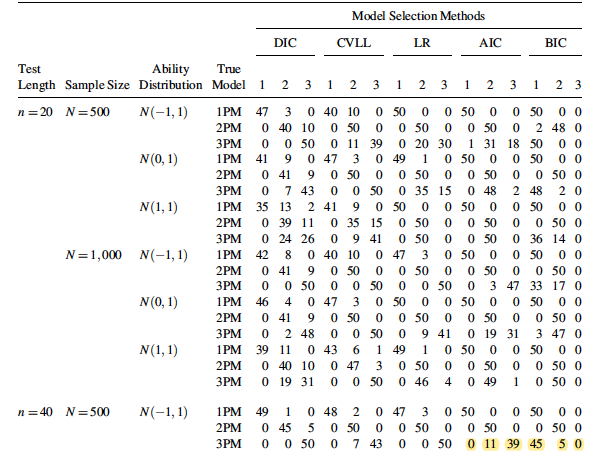

```{r}
#HTML file with output details is here:
# https://rpubs.com/rkap786/701341

```


```{r setup, include=FALSE}
knitr::opts_chunk$set(echo = TRUE)
```

```{r}

#install.packages("styler")
library(styler)
#install.packages("dplyr")
library(tidyr)
library(dplyr)
library(stringr) 
library(ggplot2)
library(readr)
library(norm)
library(knitr)


#install.packages("psych")
library(psych)
library(mirt)


#install.packages("lmtest")
library(lmtest)

setwd("~/Documents/Stanford work/IRT/irt-trial")
```


### Simulate dataset


```{r}


 #Set the seed and generate the parameters

##function to generate dataset
 
fun_simulate_data= function(nitem, sample.size, model,a, b,c, ability) {
 #Simulate response data 
 	if (model == "1PL"){
 dat <- simdata(a = a, 
                d = b, 
                N = sample.size, 
                itemtype = '2PL', 
                Theta = ability)
 	}
 
 if (model == "2PL"){
 dat <- simdata(a = a, 
                d = b, 
                N = sample.size, 
                itemtype = '2PL', 
                Theta = ability)
 }
 
 if (model == "3PL"){
 dat <- simdata(a = a, 
                d = b, 
                N = sample.size, 
                itemtype = '3PL', 
                guess = c, 
                Theta = ability)
 }

  return(dat)
  
 }
 

```

### Function for fit

```{r}
fun_model_fit= function(model1PL, model2PL, model3PL) {
  
#extract fit statistics
aic1PL = extract.mirt(model1PL, 'AIC')
bic1PL = extract.mirt(model1PL, 'BIC')
Gsq_1PL = extract.mirt(model1PL, 'G2')
loglik_1PL=extract.mirt(model1PL, "logLik")


parameters= cbind("model"=c("1PL"), "AIC"=round(aic1PL,3), "BIC"=round(bic1PL,3), "G-sq"=round(Gsq_1PL,3), "LL"=round(loglik_1PL, 3))

aic2PL = extract.mirt(model2PL, 'AIC')
bic2PL = extract.mirt(model2PL, 'BIC')
Gsq_2PL = extract.mirt(model2PL, 'G2')
loglik_2PL=extract.mirt(model2PL, "logLik")

parameters1= cbind("model"=c("2PL"), "AIC"=round(aic2PL,3), "BIC"=round(bic2PL,3), "G-sq"=round(Gsq_2PL,3), "LL"=round(loglik_2PL, 3))

aic3PL = extract.mirt(model3PL, 'AIC')
bic3PL = extract.mirt(model3PL, 'BIC')
Gsq_3PL = extract.mirt(model3PL, 'G2')
loglik_3PL=extract.mirt(model3PL, "logLik")

parameters2= cbind("model"=c("3PL"), "AIC"=round(aic3PL,3), "BIC"=round(bic3PL,3), "G-sq"=round(Gsq_3PL,3), "LL"=round(loglik_3PL, 3))

#combine fit statistics
parameters=rbind(parameters, parameters1, parameters2)

return(parameters)
}

```


### Compare models (Table 9)


```{r}

### Kang-Cohen's parameters (code from Ben's R files)

# a <- as.matrix(round(rlnorm(20, meanlog = 0, sdlog = 1),3), ncol=1) #lognormal
# b <- as.matrix(round(rnorm(20, mean = 0, sd = 1),3), ncol=1) #normal
# c <- as.matrix(round(rbeta(20, shape1 = 5, shape2 = 17),3), ncol=1) #beta


a1 <- c(1.1005, NA, 2.2093, NA, 1.4493, NA, 0.7514, NA, 1.5789, NA, 0.6425, NA, 1.6254, NA, 1.3415, NA, 0.918, NA, 1.8027, NA, 0.8159, NA, 0.9375, NA, 0.9126, NA, 1.9395, NA, 0.3746, NA, 0.673, NA, 0.4166, NA, 1.2093, NA, 0.9486, NA, 1.4916)
b1 <- c("0.4078", NA, "0.5696", NA, "–1.0610", NA, "–0.2437", NA, "0.3206", NA, "–1.3762", NA, "–0.9800", NA, "–0.6881", NA, "–0.3526", NA, "0.2400", NA, "0.5917", NA, "1.8891", NA, "–0.2690", NA, "0.3673", NA, "–0.9681", NA, "–1.2601", NA, "0.5225", NA, "–1.3356", NA, "0.9515", NA, "0.9811")
c1 <- c(0.2228, NA, 0.2332, NA, 0.2337, NA, 0.1445, NA, 0.2581, NA, 0.2712, NA, 0.1232, NA, 0.1954, NA, 0.2709, NA, 0.2984, NA, 0.0587, NA, 0.1405, NA, 0.2339, NA, 0.2387, NA, 0.3527, NA, 0.1206, NA, 0.1244, NA, 0.1167, NA, 0.2787, NA, 0.1923)
a2 <- c(0.5659, NA, 0.6128, NA, 1.1037, NA, 1.9886, NA, 0.5691, NA, 1.0346, NA, 1.1384, NA, 3.3488, NA, 2.6306, NA, 0.6652, NA, 1.0342, NA, 1.0163, NA, 1.2945, NA, 1.6521, NA, 0.9696, NA, 1.2369, NA, 0.7812, NA, 0.7728, NA, 0.5441, NA, 1.4025)
b2 <- c("–0.1257", NA, "–0.7826", NA, "0.0615", NA, "0.4244", NA, "–0.7350", NA, "0.9836", NA, "–1.2651", NA, "–0.2252", NA, "–0.6576", NA, "1.7007", NA, "1.0805", NA, "–2.0452", NA, "0.1627", NA, "0.0573", NA, "1.2171", NA, "2.1226", NA, "0.4228", NA, "–0.1656", NA, "–0.2055", NA, "1.2841")
c2 <- c(0.3426, NA, 0.1925, NA, 0.2324, NA, 0.1396, NA, 0.2059, NA, 0.3124, NA, 0.1832, NA, 0.1811, NA, 0.2537, NA, 0.2184, NA, 0.2261, NA, 0.3464, NA, 0.1455, NA, 0.3861, NA, 0.1046, NA, 0.1656, NA, 0.2696, NA, 0.178, NA, 0.1961, NA, 0.2917)

# clean up
a <- c(a1, a2)
a <- a[!is.na(a)]
b <- c(b1, b2)
b <- as.numeric(stringr::str_replace(b, "–", "-"))
b <- b[!is.na(b)]
b <- -b
c <- c(c1, c2)
c <- c[!is.na(c)]


# Empty variables 
 c1<- matrix(rep( 0, len=20), ncol = 1)
 a1<- matrix(rep( 1, len=20), ncol = 1)


```


This is done for models with
- Low ability
- 40 items, 1000 respondents 

```{r warning=T}
# Iterate for 50 loops to see which model fits best
# Set parameters

iter=50

nitem=40
sample.size=1000


low_ability <- as.matrix(round(rnorm(sample.size, mean = -1, sd = 1),3), ncol=1) #normal
#med_ability <- as.matrix(round(rnorm(sample.size, mean = 0, sd = 1),3), ncol=1) #normal
#high_ability <- as.matrix(round(rnorm(sample.size, mean = 1, sd = 1),3), ncol=1) #normal

```


#### For 1PL DGM, low ability
```{r warning=T}


# Create vectors to record results from iterations
bestfit_1PL= data.frame(iteration=1:iter, "AIC"=0, "BIC"=0, "G-sq"=0, "LL"=0)


# Create vectors to record final summary
	for (i in 1:iter){
dat_1PL = fun_simulate_data(nitem, sample.size, "1PL", a1, b,c1, low_ability)

#Estimate
model1PL <- mirt(data=dat_1PL, 1, itemtype='Rasch', SE=TRUE, verbose=FALSE)
model2PL <- mirt(data=dat_1PL, 1, itemtype='2PL', SE=TRUE, verbose=FALSE)
model3PL <- mirt(data=dat_1PL, 1, itemtype='3PL', SE=TRUE, verbose=FALSE)

}


# 
# summary_1PL = bestfit_1PL %>%
#    replace(is.na(.), 0) %>%
#   select(-"iteration") %>%
#    summarise_all(funs(sum)) %>%
#   mutate(model= "1PL")

df_AIC=data.frame(AIC_count=unclass(table(bestfit_1PL$AIC)))
df_AIC$model_selected = row.names(df_AIC)

df_BIC=data.frame(BIC_count=unclass(table(bestfit_1PL$BIC)))
df_BIC$model_selected = row.names(df_BIC)

results1 = merge(df_AIC,df_BIC,by="model_selected", all = T)
results1$DGM = "1PL"


  

```

#### Data generated using 2PL

```{r warning=T}

# Generate datasets, low ability

# Create vectors to record results from iterations
bestfit_2PL= data.frame(iteration=1:iter, "AIC"=0, "BIC"=0, "G-sq"=0, "LL"=0)

	for (i in 1:iter){
#Estimate
dat_2PL = fun_simulate_data(nitem, sample.size, "2PL", a, b,c1, low_ability)
model1PL <- mirt(data=dat_2PL, 1, itemtype='Rasch', SE=TRUE, verbose=FALSE)
model2PL <- mirt(data=dat_2PL, 1, itemtype='2PL', SE=TRUE, verbose=FALSE)
model3PL <- mirt(data=dat_2PL, 1, itemtype='3PL', SE=TRUE, verbose=FALSE)

compare = as.data.frame(fun_model_fit(model1PL, model2PL, model3PL))

bestfit_2PL[i,2]=which.min(compare$AIC)
bestfit_2PL[i,3]=which.min(compare$BIC)
bestfit_2PL[i,4]=which.min(compare$`G-sq`)
bestfit_2PL[i,5]=which.max(compare$LL)

}


# 
# summary_1PL = bestfit_1PL %>%
#    replace(is.na(.), 0) %>%
#   select(-"iteration") %>%
#    summarise_all(funs(sum)) %>%
#   mutate(model= "1PL")
# 
# fit = apply(bestfit_2PL,MARGIN=2,table)
# 
# summary_2PL = cbind(model= "2PL", 
#                     AIC=as.numeric(fit$AIC[1]),
#                     BIC=as.numeric(fit$BIC[1]),
#                     LL=as.numeric(fit$LL[1]))
# 
# summary= rbind(summary_1PL, summary_2PL)


df_AIC=data.frame(AIC_count=unclass(table(bestfit_2PL$AIC)))
df_AIC$model_selected = row.names(df_AIC)

df_BIC=data.frame(BIC_count=unclass(table(bestfit_2PL$BIC)))
df_BIC$model_selected = row.names(df_BIC)

results2 = merge(df_AIC,df_BIC,by="model_selected", all = T)
results2$DGM = "2PL"


```


#### Data generated using 3PL

```{r warning=T}
# Generate datasets, low ability


# Create vectors to record results from iterations
bestfit_3PL= data.frame(iteration=1:iter, "AIC"=0, "BIC"=0, "G-sq"=0, "LL"=0)

for (i in 1:iter){
dat_3PL = fun_simulate_data(nitem, sample.size, "3PL", a, b,c, low_ability)
#Estimate
model1PL <- mirt(data=dat_3PL, 1, itemtype='Rasch', SE=F, verbose=FALSE)
model2PL <- mirt(data=dat_3PL, 1, itemtype='2PL', SE=F, verbose=FALSE)
model3PL <- mirt(data=dat_3PL, 1, itemtype='3PL', SE=F, verbose=FALSE)

compare = as.data.frame(fun_model_fit(model1PL, model2PL, model3PL))
bestfit_3PL[i,2]=which.min(compare$AIC)
bestfit_3PL[i,3]=which.min(compare$BIC)
bestfit_3PL[i,4]=which.min(compare$`G-sq`)
bestfit_3PL[i,5]=which.max(compare$LL)

}


df_AIC=data.frame(AIC_count=unclass(table(bestfit_3PL$AIC)))
df_AIC$model_selected = row.names(df_AIC)


df_BIC=data.frame(BIC_count=unclass(table(bestfit_3PL$BIC)))
df_BIC$model_selected = row.names(df_BIC)

results3 = merge(df_AIC,df_BIC,by="model_selected", all = T)
results3$DGM = "3PL"


results = rbind(results1, results2, results3)
results


```


### Summary

Results for low ability, 40 items, 500 sample size above. Results from Kang-Cohen below
 

